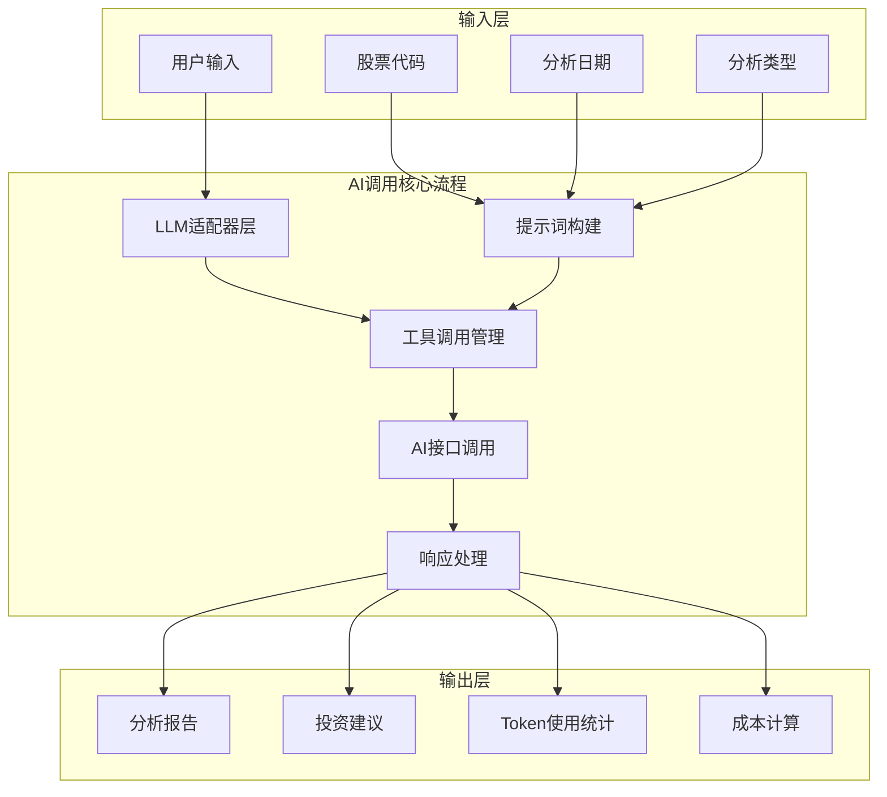
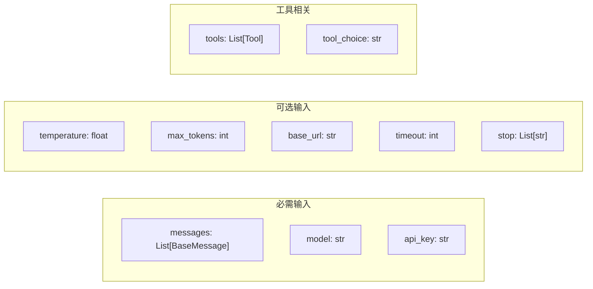
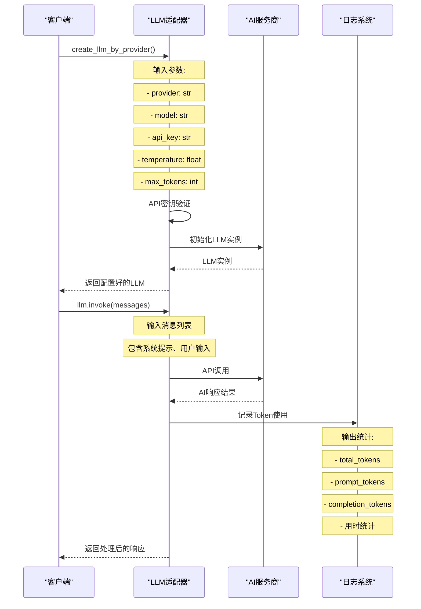
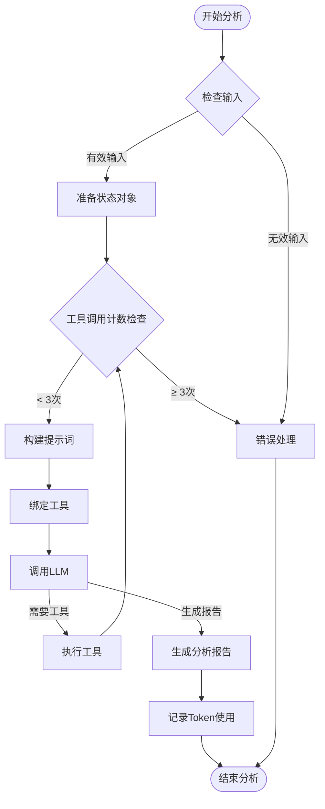
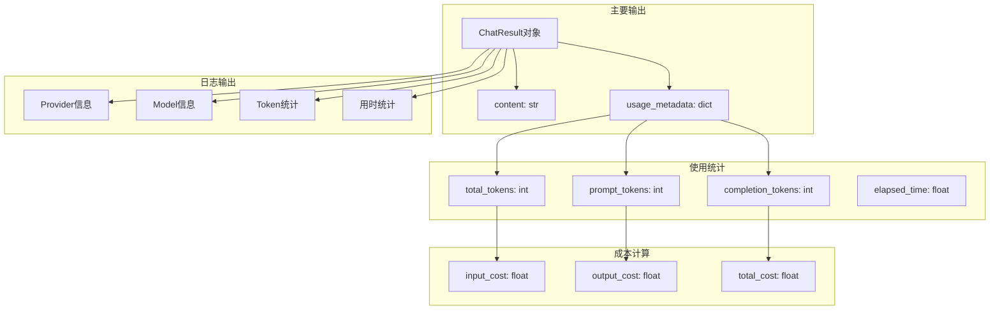
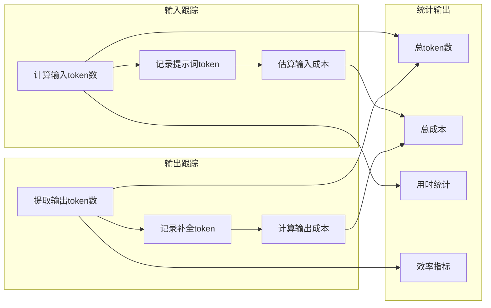

# AI调用流程图 - 输入输出详解

## 🎯 概述

本文档详细阐述了TradingAgents-CN项目中AI接口调用的完整流程，包括输入参数、处理逻辑和输出结果。

## 📊 系统架构图



## 🔧 AI调用详细流程

### 1. 输入参数定义



### 2. LLM适配器输入输出



### 3. 单个分析师AI调用流程



### 4. 输入输出详细说明

#### 4.1 输入参数详解

| 参数类别 | 参数名称 | 类型 | 必需 | 说明 |
|---------|---------|------|------|------|
| **基础参数** | messages | List[BaseMessage] | ✅ | 消息列表，包含系统提示和用户输入 |
| | model | string | ✅ | 模型名称，如"qwen-turbo" |
| | api_key | string | ✅ | API密钥，支持环境变量读取 |
| **生成参数** | temperature | float | ❌ | 温度参数，控制随机性 (0.0-1.0) |
| | max_tokens | integer | ❌ | 最大生成token数 |
| | timeout | integer | ❌ | 超时时间（秒） |
| **连接参数** | base_url | string | ❌ | 自定义API端点 |
| | stop | List[string] | ❌ | 停止词列表 |
| **工具参数** | tools | List[Tool] | ❌ | 可用工具列表 |
| | tool_choice | string | ❌ | 工具选择策略 |

#### 4.2 输出结果详解



### 5. 具体代码示例

#### 5.1 基础AI调用

```python
# 输入参数
messages = [
    SystemMessage(content="你是一个专业的股票分析师"),
    HumanMessage(content="请分析AAPL股票的技术指标")
]

# 调用参数
model = "qwen-turbo"
api_key = "your-api-key"
temperature = 0.7
max_tokens = 2000

# 执行调用
llm = create_llm_by_provider(
    provider="dashscope",
    model=model,
    api_key=api_key,
    temperature=temperature,
    max_tokens=max_tokens
)

# 输出结果
result = llm.invoke(messages)
print(f"分析结果: {result.content}")
print(f"Token使用: {result.usage_metadata}")
```

#### 5.2 带工具调用的AI调用

```python
# 输入参数（包含工具）
messages = [
    SystemMessage(content="使用工具获取股票数据"),
    HumanMessage(content="获取TSLA的市场数据")
]

# 工具定义
tools = [get_stock_market_data_unified]

# 绑定工具并调用
llm_with_tools = llm.bind_tools(tools)
result = llm_with_tools.invoke(messages)

# 输出包含工具调用
if result.tool_calls:
    print(f"工具调用: {result.tool_calls}")
print(f"最终响应: {result.content}")
```

### 6. Token使用和成本跟踪



### 7. 错误处理机制

#### 7.1 API密钥验证

```python
def validate_api_key(api_key: str) -> bool:
    """验证API密钥有效性"""
    if not api_key or len(api_key) <= 10:
        return False
    if api_key.startswith('your_') or api_key.startswith('your-'):
        return False
    if '...' in api_key:
        return False
    return True
```

#### 7.2 异常处理

```python
try:
    result = llm.invoke(messages)
except ValueError as e:
    logger.error(f"API密钥错误: {e}")
    raise ValueError("请检查API密钥配置")
except TimeoutError as e:
    logger.error(f"请求超时: {e}")
    raise TimeoutError("AI服务响应超时")
except Exception as e:
    logger.error(f"AI调用失败: {e}")
    raise RuntimeError(f"AI调用失败: {str(e)}")
```

## 📝 总结

AI调用流程的核心特点：

1. **统一接口**：通过适配器模式支持多种AI服务商
2. **完整跟踪**：详细记录Token使用和成本统计
3. **工具集成**：支持函数调用和工具使用
4. **错误处理**：完善的异常处理和验证机制
5. **性能优化**：防死循环机制和超时控制

该流程确保了AI调用的可靠性、可追踪性和成本可控性。