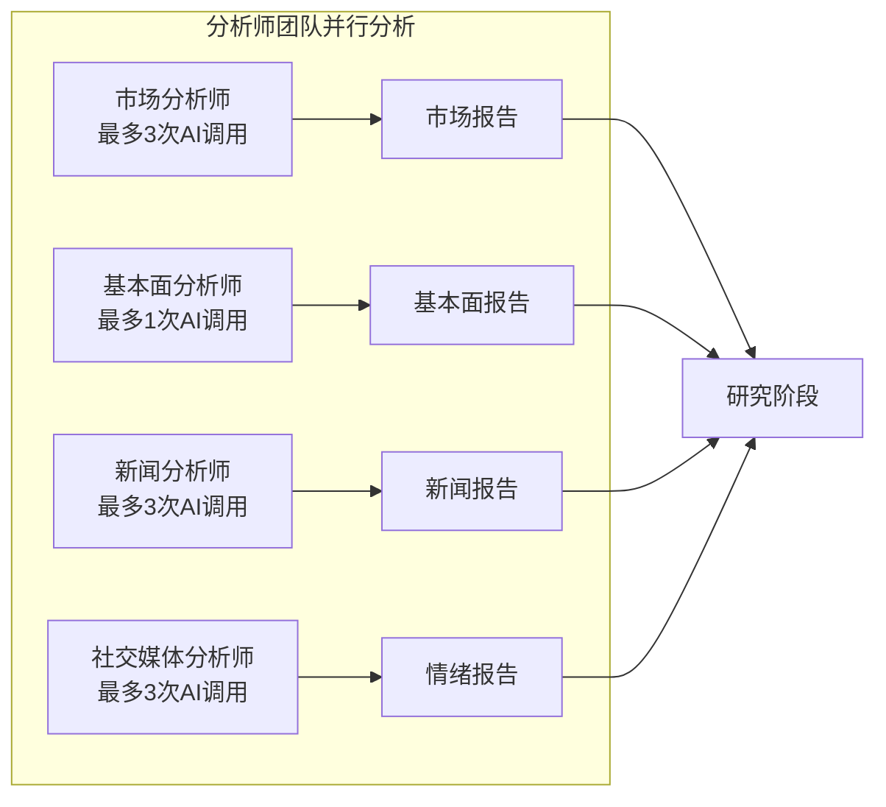
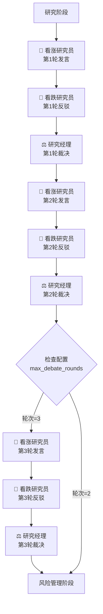
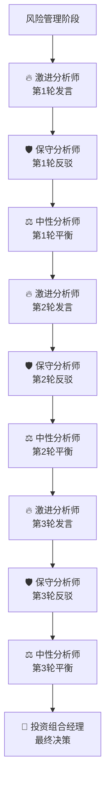
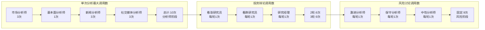
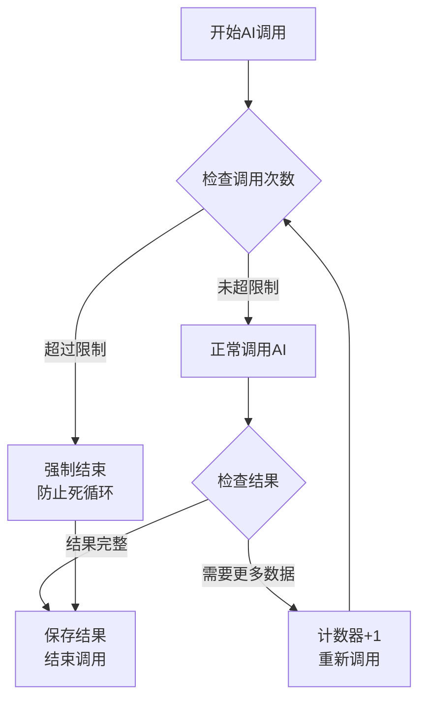
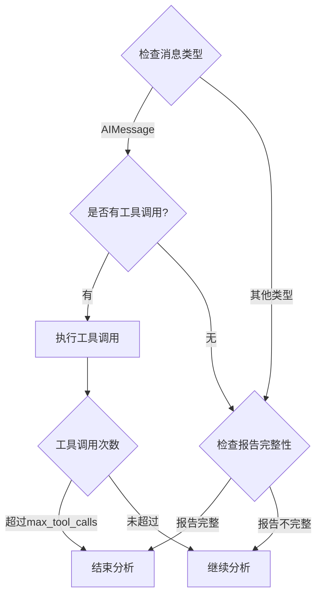
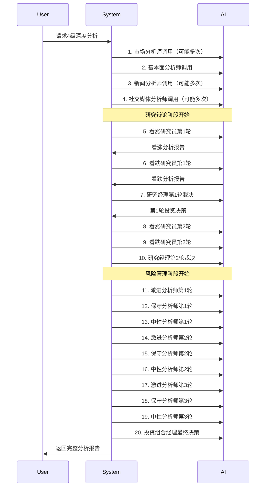

# TradingAgents AI多次调用流程图

## 🔄 系统架构概览

```mermaid
graph TB
    Start([开始分析]) --> Init[初始化分析参数]
    Init --> Depth{选择研究深度}
    
    Depth -->|1级(最快)| QuickPath[快速分析路径]
    Depth -->|2级(快速)| FastPath[快速辩论路径] 
    Depth -->|3级(标准)| StandardPath[标准分析路径]
    Depth -->|4级(深度)| DeepPath[深度分析路径]
    Depth -->|5级(最深度)| UltraPath[超深度分析路径]
    
    QuickPath --> End([结束])
    FastPath --> End
    StandardPath --> End
    DeepPath --> End
    UltraPath --> End
```

## 📊 AI多次调用详细流程

### 基础分析师阶段（所有级别）



### 研究辩论阶段（2-5级）



### 风险管理阶段（3-5级）



## 🔢 AI调用次数统计

### 各级别AI调用总数

| 研究深度 | 分析师团队 | 投资辩论 | 风险讨论 | **总计** |
|---------|------------|----------|----------|----------|
| 1级(最快) | 4-10次 | 0次 | 0次 | **4-10次** |
| 2级(快速) | 4-10次 | 4次 | 0次 | **8-14次** |
| 3级(标准) | 4-10次 | 6次 | 9次 | **19-25次** |
| 4级(深度) | 4-10次 | 6次 | 9次 | **19-25次** |
| 5级(最深度) | 4-10次 | 9次 | 9次 | **22-28次** |

### 详细调用分解



## ⚙️ 循环控制机制

### 防死循环保护



### 条件判断逻辑



## 🎯 实际调用序列示例

### 4级深度分析完整流程



## 🔍 关键控制参数

### 核心配置项

```python
# 工具调用次数限制
MAX_TOOL_CALLS = {
    "market": 3,        # 市场分析师
    "news": 3,          # 新闻分析师
    "social": 3,        # 社交媒体分析师
    "fundamentals": 1   # 基本面分析师
}

# 辩论轮次配置
MAX_DEBATE_ROUNDS = 2           # 投资辩论轮次
MAX_RISK_DISCUSS_ROUNDS = 3     # 风险讨论轮次

# 研究深度映射
RESEARCH_DEPTH_LEVELS = {
    1: {"debate": 0, "risk": 0},    # 最快
    2: {"debate": 1, "risk": 0},    # 快速  
    3: {"debate": 2, "risk": 3},    # 标准
    4: {"debate": 2, "risk": 3},    # 深度
    5: {"debate": 3, "risk": 3}     # 最深度
}
```

## 💡 总结

TradingAgents的AI多次调用机制体现了以下特点：

1. **层次化调用**：从基础分析到深度辩论的渐进式调用
2. **并行处理**：多个分析师可以同时进行分析
3. **循环控制**：严格的次数限制防止死循环
4. **质量保障**：多轮辩论确保分析结果的全面性
5. **灵活配置**：可根据需求调整研究深度和调用次数

这种设计既保证了分析质量，又通过合理的调用控制确保了系统性能和成本效益。