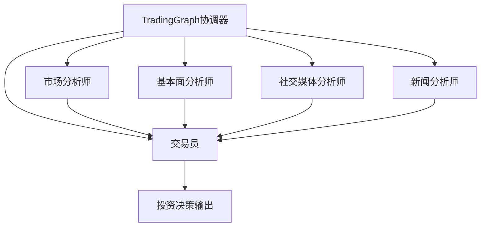

# TradingAgents-CN 智能体协作流程文档

## 概述

TradingAgents-CN 采用多智能体协作架构，通过专业的分工和高效的信息共享机制，实现全面的投资分析。本文档详细描述了各智能体之间的协作流程、信息传递机制以及决策制定过程。

## 协作架构

### 智能体角色定义



### 智能体专业分工

| 智能体 | 专业领域 | 主要职责 | 输出内容 |
|--------|----------|----------|----------|
| 市场分析师 | 技术分析 | 技术指标分析、趋势识别、支撑阻力判断 | 技术分析报告 |
| 基本面分析师 | 基本面分析 | 财务数据分析、估值模型、行业对比 | 基本面分析报告 |
| 社交媒体分析师 | 情绪分析 | 社交媒体监控、KOL影响力分析 | 情绪分析报告 |
| 新闻分析师 | 事件分析 | 新闻事件识别、影响评估、趋势分析 | 新闻分析报告 |
| 交易员 | 综合决策 | 多维度分析融合、交易决策制定 | 投资建议报告 |

## 协作流程详解

### 1. 初始化阶段

#### 1.1 参数接收与验证
```python
# 输入参数
company_name: str      # 公司名称或股票代码
trade_date: str        # 交易日期
progress_callback:    # 进度回调函数（可选）
task_id: str          # 任务ID（可选）
```

#### 1.2 初始状态构建
```python
# AgentState 初始状态
{
    "company_of_interest": company_name,    # 目标公司
    "trade_date": trade_date,               # 交易日期
    "messages": [],                         # 消息历史
    "market_report": "",                    # 市场分析报告
    "fundamentals_report": "",              # 基本面分析报告
    "sentiment_report": "",                 # 情绪分析报告
    "news_report": "",                      # 新闻分析报告
    "investment_plan": "",                  # 投资计划
    "trader_investment_plan": "",           # 交易员建议
    "*_tool_call_count": 0                   # 各智能体工具调用计数
}
```

### 2. 并行分析阶段

#### 2.1 市场分析师工作流

**执行流程：**
1. **股票类型识别**
   - 自动识别A股（6位数字）、港股（.HK后缀）、美股
   - 获取对应市场信息和货币单位

2. **公司名称获取**
   ```python
   # 多市场智能识别
   if 中国A股:
       使用统一接口获取股票名称
       支持降级方案确保可用性
   elif 港股:
       使用改进港股工具获取名称
       降级方案生成友好默认名称
   elif 美股:
       使用预设映射表
       返回标准化美股名称
   ```

3. **技术分析执行**
   - 调用统一市场数据工具
   - 获取多周期技术指标
   - 执行LLM分析生成报告

4. **状态更新**
   ```python
   state.update({
       "messages": [分析消息, 工具调用结果],
       "market_report": 技术分析报告,
       "market_tool_call_count": 工具调用次数
   })
   ```

**特性：**
- 防死循环：最大3次工具调用限制
- 多语言支持：中英文混合处理
- 智能降级：确保数据可用性

#### 2.2 基本面分析师工作流

**执行流程：**
1. **财务数据获取**
   - 获取最新财务报表
   - 计算关键财务指标

2. **估值分析**
   - P/E、P/B、EV/EBITDA分析
   - DCF估值模型计算
   - 行业对比分析

3. **风险评估**
   - 财务健康度评估
   - 债务风险分析
   - 成长性评估

4. **报告生成**
   - 结构化分析报告
   - 具体估值建议
   - 风险提示

#### 2.3 社交媒体分析师工作流

**执行流程：**
1. **多平台数据获取**
   - 雪球、东方财富股吧监控
   - 财经新闻情绪分析
   - 社交媒体热度统计

2. **情绪量化分析**
   - 投资者情绪指数计算（1-10分）
   - KOL观点影响力评估
   - 情绪变化趋势识别

3. **热点事件分析**
   - 政策变化影响评估
   - 市场传言可信度分析
   - 事件对情绪的持续影响

4. **情绪-价格关联**
   - 情绪与股价相关性分析
   - 情绪极端点识别
   - 情绪反转信号检测

#### 2.4 新闻分析师工作流

**执行流程：**
1. **新闻事件识别**
   - 实时新闻搜索和分类
   - 重大事件自动识别
   - 事件重要性评级

2. **影响评估**
   - 对公司的直接影响分析
   - 行业连锁反应评估
   - 市场情绪影响判断

3. **趋势分析**
   - 新闻热度时间序列
   - 媒体关注度变化
   - 事件发展预期

### 3. 综合决策阶段

#### 3.1 交易员智能体工作流

**输入整合：**
```python
# 综合分析上下文
curr_situation = f"""
{market_research_report}      # 技术分析报告

{sentiment_report}            # 情绪分析报告

{news_report}                 # 新闻分析报告

{fundamentals_report}         # 基本面分析报告
"""
```

**历史经验检索：**
```python
# 记忆系统检索
if memory_available:
    past_memories = memory.get_memories(curr_situation, n_matches=2)
    # 提取历史交易经验和反思
    past_memory_str = extract_memories(past_memories)
else:
    past_memory_str = "暂无历史记忆数据可参考。"
```

**决策制定：**
1. **多维度分析融合**
   - 技术面与基本面结合
   - 情绪与事件影响权衡
   - 历史经验参考

2. **风险控制评估**
   - 置信度评估（0-1）
   - 风险评分（0-1，0为低风险）
   - 止损价位设定

3. **目标价位确定**
   - 基于估值模型的合理价格
   - 技术分析的支撑位/阻力位
   - 情绪影响的溢价/折价

4. **投资建议生成**
   ```markdown
   # 结构化输出格式
   
   ## 投资建议
   - 决策：买入/持有/卖出
   - 目标价位：具体数值（强制要求）
   - 置信度：0.XX
   - 风险评分：0.XX
   
   ## 详细推理
   - 技术面分析要点
   - 基本面支撑理由
   - 情绪面影响因素
   - 风险因素识别
   
   最终交易建议：**买入/持有/卖出**
   ```

### 4. 状态管理与输出

#### 4.1 最终状态构建
```python
# 完整状态更新
final_state = {
    # 基础信息
    "company_of_interest": company_name,
    "trade_date": trade_date,
    
    # 分析报告
    "market_report": 技术分析报告,
    "fundamentals_report": 基本面分析报告,
    "sentiment_report": 情绪分析报告,
    "news_report": 新闻分析报告,
    
    # 决策结果
    "investment_plan": 综合投资计划,
    "trader_investment_plan": 最终交易建议,
    
    # 性能统计
    "node_outputs": 各节点执行结果,
    "timing_stats": 执行时间统计,
    "llm_config": LLM配置信息
}
```

#### 4.2 性能监控
```python
# 执行时间统计
node_times = {
    "market_analyst": 1.23,      # 秒
    "fundamentals_analyst": 2.34,
    "sentiment_analyst": 1.56,
    "news_analyst": 1.78,
    "trader": 3.45,
    "total": 10.36
}

# 分类统计
performance_stats = {
    "analysts_time": 6.91,       # 分析阶段总时间
    "trader_time": 3.45,         # 决策阶段时间
    "efficiency": 66.7%          # 分析阶段占比
}
```

## 协作机制

### 1. 信息共享机制

#### 1.1 统一状态管理
- **集中式状态**: 所有智能体共享统一的AgentState
- **增量更新**: 各智能体只更新自己负责的部分
- **版本控制**: 状态变更历史记录

#### 1.2 消息传递机制
- **异步消息**: 支持智能体间的异步通信
- **消息队列**: 确保消息可靠传递
- **优先级管理**: 重要消息优先处理

### 2. 冲突解决机制

#### 2.1 分析冲突处理
```python
# 多空观点冲突示例
market_view = "看涨"      # 技术面
fundamentals_view = "看跌" # 基本面
sentiment_view = "中性"    # 情绪面

# 交易员综合权衡
final_decision = weigh_multiple_factors(
    technical=market_view,
    fundamental=fundamentals_view,
    sentiment=sentiment_view,
    confidence_weights=[0.3, 0.4, 0.3]
)
```

#### 2.2 风险控制机制
- **置信度阈值**: 低置信度决策需要额外验证
- **风险限额**: 单笔交易风险上限控制
- **止损机制**: 自动止损价位设定

### 3. 质量保障机制

#### 3.1 数据质量验证
- **数据源可靠性**: 多数据源交叉验证
- **数据完整性**: 必填字段完整性检查
- **数据时效性**: 数据新鲜度验证

#### 3.2 分析质量评估
- **逻辑一致性**: 分析逻辑自洽性检查
- **证据充分性**: 关键结论的证据支撑
- **表达清晰性**: 报告可读性评估

## 异常处理

### 1. 工具调用异常

#### 1.1 网络异常处理
```python
try:
    result = tool.invoke(params)
except NetworkError:
    # 降级到备用数据源
    result = fallback_tool.invoke(params)
    logger.warning(f"使用降级方案: {tool_name}")
```

#### 1.2 数据异常处理
```python
try:
    data = parse_response(response)
except DataFormatError:
    # 使用缓存数据或默认值
    data = get_cached_data(key) or get_default_value()
    logger.error(f"数据格式异常，使用缓存: {key}")
```

### 2. 智能体异常

#### 2.1 执行超时处理
```python
try:
    result = agent.execute(state, timeout=30)
except TimeoutError:
    # 返回部分结果或默认结果
    result = get_partial_result(agent) or get_default_result()
    state["errors"].append(f"{agent}执行超时")
```

#### 2.2 结果异常处理
```python
try:
    validate_result(result)
except ValidationError as e:
    # 修正结果格式或重新执行
    result = fix_result_format(result, e)
    logger.error(f"结果验证失败，已修正: {e}")
```

### 3. 系统级异常

#### 3.1 资源不足处理
- **内存不足**: 清理缓存，释放资源
- **CPU过载**: 降低并发度，延长超时时间
- **磁盘空间**: 清理日志，压缩历史数据

#### 3.2 依赖服务异常
- **LLM服务异常**: 切换到备用模型
- **数据库异常**: 使用文件系统缓存
- **外部API异常**: 启用离线模式

## 性能优化

### 1. 并发执行优化

#### 1.1 智能体并行执行
```python
# 分析师智能体并行执行
with ThreadPoolExecutor(max_workers=4) as executor:
    futures = {
        executor.submit(market_analyst, state): "market",
        executor.submit(fundamentals_analyst, state): "fundamentals",
        executor.submit(sentiment_analyst, state): "sentiment",
        executor.submit(news_analyst, state): "news"
    }
    
    # 收集并行结果
    for future in as_completed(futures):
        agent_type = futures[future]
        result = future.result()
        merge_result(state, agent_type, result)
```

#### 1.2 数据预加载
- **常用数据缓存**: 股票基础信息、历史数据
- **预测性加载**: 基于用户行为预加载可能用到的数据
- **增量更新**: 只更新变化的数据部分

### 2. 缓存策略

#### 2.1 多级缓存架构
```python
# 三级缓存策略
cache_hierarchy = {
    "L1": memory_cache,      # 内存缓存，毫秒级访问
    "L2": redis_cache,       # Redis缓存，秒级访问
    "L3": file_cache         # 文件缓存，分钟级访问
}
```

#### 2.2 智能缓存更新
- **基于时间的失效**: TTL机制
- **基于依赖的失效**: 数据变更触发更新
- **预加载机制**: 预测性缓存填充

### 3. 资源管理

#### 3.1 连接池管理
- **数据库连接池**: 复用数据库连接
- **HTTP连接池**: 复用HTTP连接
- **LLM连接池**: 管理LLM服务连接

#### 3.2 内存管理
- **对象池**: 复用频繁创建的对象
- **垃圾回收优化**: 减少GC压力
- **内存监控**: 实时内存使用监控

## 监控与度量

### 1. 性能指标

#### 1.1 时间指标
- **端到端延迟**: 完整分析流程耗时
- **智能体执行时间**: 各智能体单独耗时
- **工具调用时间**: 外部工具调用耗时

#### 1.2 资源指标
- **CPU使用率**: 系统CPU消耗
- **内存使用量**: 内存消耗趋势
- **网络带宽**: 网络流量统计

### 2. 业务指标

#### 2.1 质量指标
- **分析准确率**: 基于历史回测的准确率
- **决策一致性**: 相似情况下的决策一致性
- **报告完整性**: 报告字段完整性统计

#### 2.2 效率指标
- **缓存命中率**: 缓存命中比例
- **工具成功率**: 工具调用成功比例
- **异常处理率**: 异常情况处理成功率

### 3. 告警机制

#### 3.1 性能告警
- **响应时间告警**: 超过阈值触发告警
- **错误率告警**: 错误率超过阈值告警
- **资源使用率告警**: 资源使用过高告警

#### 3.2 业务告警
- **数据质量告警**: 数据异常触发告警
- **分析质量告警**: 分析结果异常告警
- **系统异常告警**: 系统级异常告警

## 总结

TradingAgents-CN 的智能体协作流程通过专业化的分工、高效的信息共享机制和严格的质量控制，实现了多维度、全方位的投资分析。系统具备良好的扩展性、容错性和性能优化机制，能够为用户提供专业、可靠的投资决策支持。