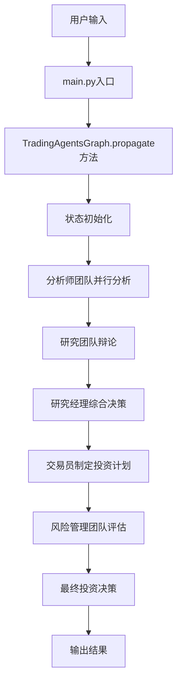
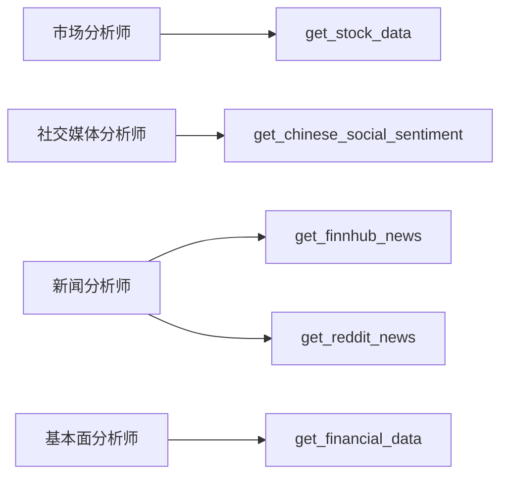
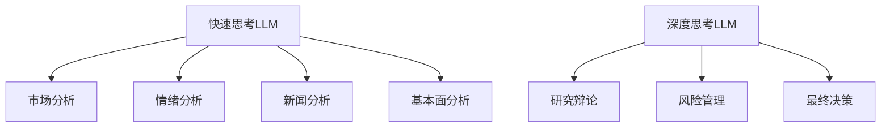

# 股票代码到决策输出的全流程调用图

## 系统总览

TradingAgents-CN系统采用多智能体协作架构，从用户输入股票代码到输出最终投资决策，经过以下主要阶段：



## 详细调用流程

### 1. 用户输入阶段

**调用位置**: `/Users/fei/Documents/demo/TradingAgents-CN/main.py` (第19-21行)

```python
# Initialize with custom config
ta = TradingAgentsGraph(debug=True, config=config)

# forward propagate
_, decision = ta.propagate("NVDA", "2024-05-10")
```

**关键参数**:
- 股票代码: `"NVDA"`
- 交易日期: `"2024-05-10"`

### 2. 图引擎初始化

**调用位置**: `tradingagents/graph/trading_graph.py` (第945行)

```python
def propagate(self, company_name, trade_date, progress_callback=None, task_id=None):
```

**主要功能**:
- 接收用户输入参数
- 设置实例变量 `self.ticker = company_name`
- 初始化性能计时器
- 配置进度回调

### 3. 状态初始化

**调用位置**: `tradingagents/graph/propagation.py` (第22行)

```python
def create_initial_state(self, company_name: str, trade_date: str) -> Dict[str, Any]:
```

**初始化内容**:
```python
{
    "messages": [HumanMessage(content=f"请对股票 {company_name} 进行全面分析，交易日期为 {trade_date}。")],
    "company_of_interest": company_name,
    "trade_date": str(trade_date),
    "investment_debate_state": InvestDebateState({"history": "", "current_response": "", "count": 0}),
    "risk_debate_state": RiskDebateState({...}),
    "market_report": "",
    "fundamentals_report": "",
    "sentiment_report": "",
    "news_report": ""
}
```

### 4. 分析师团队分析阶段

**图结构构建位置**: `tradingagents/graph/setup.py` (第164-178行)

**分析师节点添加**:
```python
# 添加分析师节点
workflow.add_node("Market Analyst", market_node)
workflow.add_node("Social Media Analyst", social_node)
workflow.add_node("News Analyst", news_node)
workflow.add_node("Fundamentals Analyst", fundamentals_node)

# 添加工具节点
workflow.add_node("tools_market", tool_nodes["market"])
workflow.add_node("tools_social", tool_nodes["social"])
# ... 其他工具节点
```

**执行顺序控制**:
```python
# 从开始到第一个分析师
workflow.add_edge(START, "Market Analyst")

# 分析师之间的顺序连接
workflow.add_edge("Market Analyst", "Social Media Analyst")
workflow.add_edge("Social Media Analyst", "News Analyst")
workflow.add_edge("News Analyst", "Fundamentals Analyst")
```

### 5. 具体分析师实现

#### 5.1 市场分析师
**实现位置**: `tradingagents/agents/analysts/market_analyst.py`

**核心逻辑**:
```python
def market_analyst_node(state: AgentState) -> AgentState:
    # 1. 获取工具调用计数
    # 2. 调用get_stock_data工具获取市场数据
    # 3. 基于LLM生成市场分析报告
    # 4. 更新状态中的market_report
```

#### 5.2 社交媒体分析师
**实现位置**: `tradingagents/agents/analysts/social_media_analyst.py`

**核心逻辑**:
```python
def social_media_analyst_node(state: AgentState) -> AgentState:
    # 1. 获取中国社交媒体情绪数据
    # 2. 调用unified_sentiment_analysis工具
    # 3. 基于LLM生成情绪分析报告
    # 4. 更新状态中的sentiment_report
```

#### 5.3 新闻分析师
**实现位置**: `tradingagents/agents/analysts/news_analyst.py`

**核心逻辑**:
- 获取Finnhub和Reddit新闻数据
- 分析新闻影响
- 生成news_report

#### 5.4 基本面分析师
**实现位置**: `tradingagents/agents/analysts/fundamentals_analyst.py`

**核心逻辑**:
- 获取财务报表数据
- 分析估值指标
- 生成fundamentals_report

### 6. 研究团队辩论阶段

**研究团队节点添加**:
```python
workflow.add_node("Bull Researcher", bull_researcher_node)
workflow.add_node("Bear Researcher", bear_researcher_node)
workflow.add_node("Research Manager", research_manager_node)
```

**辩论流程**:
```python
# 条件边控制辩论流程
workflow.add_conditional_edges(
    "Bull Researcher",
    should_continue_debate,
    {
        "Bear Researcher": "Bear Researcher",
        "Research Manager": "Research Manager",
    },
)
```

### 7. 交易员决策阶段

**交易员节点实现**:
```python
workflow.add_node("Trader", trader_node)
```

**实现位置**: `tradingagents/agents/trader/trader.py`

**核心功能**:
- 综合分析所有报告
- 制定投资策略
- 计算目标价位
- 生成投资计划

### 8. 风险管理评估阶段

**风险管理节点添加**:
```python
workflow.add_node("Risky Analyst", risky_analyst)
workflow.add_node("Neutral Analyst", neutral_analyst)
workflow.add_node("Safe Analyst", safe_analyst)
workflow.add_node("Risk Judge", risk_manager_node)
```

**风险评估流程**:
```python
workflow.add_edge("Trader", "Risky Analyst")
workflow.add_conditional_edges(
    "Risky Analyst",
    should_continue_risk_analysis,
    {
        "Safe Analyst": "Safe Analyst",
        "Risk Judge": "Risk Judge",
    },
)
```

### 9. 最终决策输出

**决策合并位置**: `tradingagents/graph/trading_graph.py` (第1100-1144行)

**最终状态结构**:
```python
final_state = {
    "company_of_interest": "NVDA",
    "trade_date": "2024-05-10",
    "market_report": "市场数据分析报告...",
    "sentiment_report": "情绪分析报告...",
    "news_report": "新闻分析报告...",
    "fundamentals_report": "基本面分析报告...",
    "investment_debate_state": {...},
    "trader_investment_decision": {...},
    "risk_debate_state": {...},
    "investment_plan": "最终投资计划...",
    "final_trade_decision": "最终交易决策...",
    "performance_stats": {...}
}
```

## 工具调用链

### 数据获取工具链



### LLM调用链



## 性能监控

**计时统计位置**: `tradingagents/graph/trading_graph.py` (第1000-1040行)

**监控指标**:
- 每个节点的执行时间
- 总执行时间
- LLM调用次数
- 工具调用次数

**输出格式**:
```
⏱️ [Market Analyst] 耗时: 2.34秒
⏱️ [Social Media Analyst] 耗时: 1.87秒
⏱️ [Research Manager] 耗时: 3.21秒
🔍 [TIMING] 总耗时: 15.67秒
```

## 错误处理机制

### 重试机制
```python
# 工具调用失败重试
for attempt in range(max_retries):
    try:
        result = tool_function(**params)
        break
    except Exception as e:
        if attempt == max_retries - 1:
            raise e
        time.sleep(retry_delay)
```

### 降级处理
- LLM调用失败时切换到备用模型
- 工具调用失败时返回默认值
- 网络超时时使用缓存数据

## 内存管理

**记忆系统位置**: `tradingagents/agents/utils/memory.py`

**记忆类型**:
- 多头研究员记忆
- 空头研究员记忆
- 研究经理记忆
- 交易员记忆
- 风险管理员记忆

**记忆更新**:
```python
def update_memory(self, key, value):
    self.memory[key] = value
    self.save_to_file()
```

这个全流程图展示了从用户输入股票代码到输出最终投资决策的完整调用链，包含了所有关键的代码位置和调用方法，帮助理解整个系统的运行机制。