# 智能体协作流程图

## 系统总览

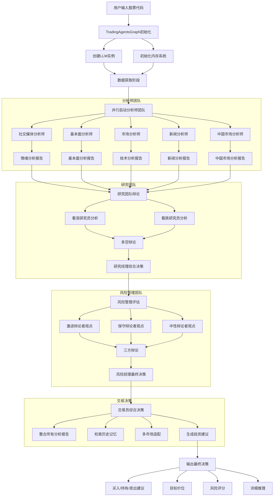

## 详细流程分解

### 1. 初始化阶段

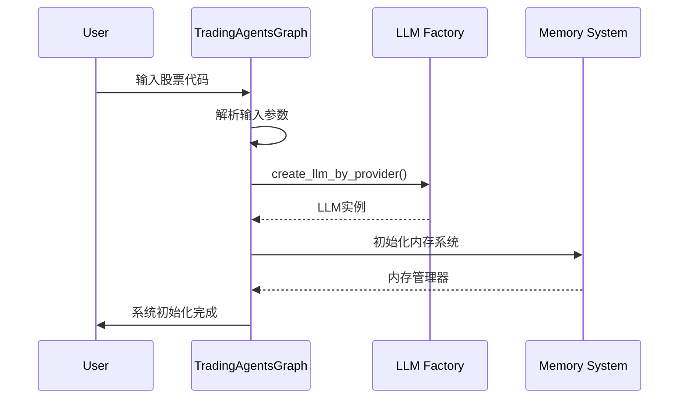

### 2. 数据获取与分析阶段

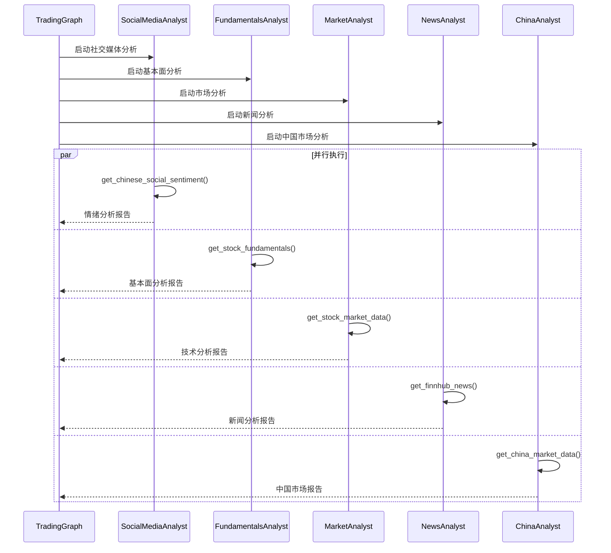

### 3. 研究团队辩论阶段

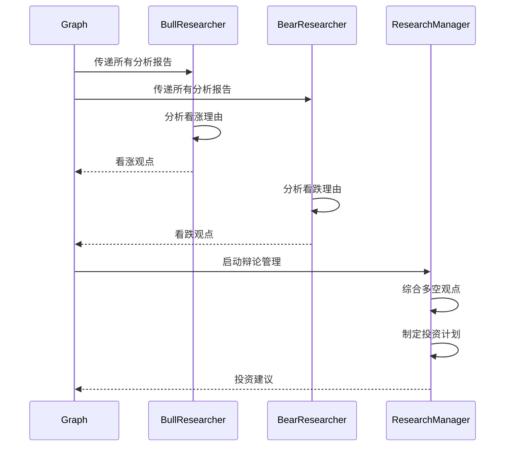

### 4. 风险管理评估阶段

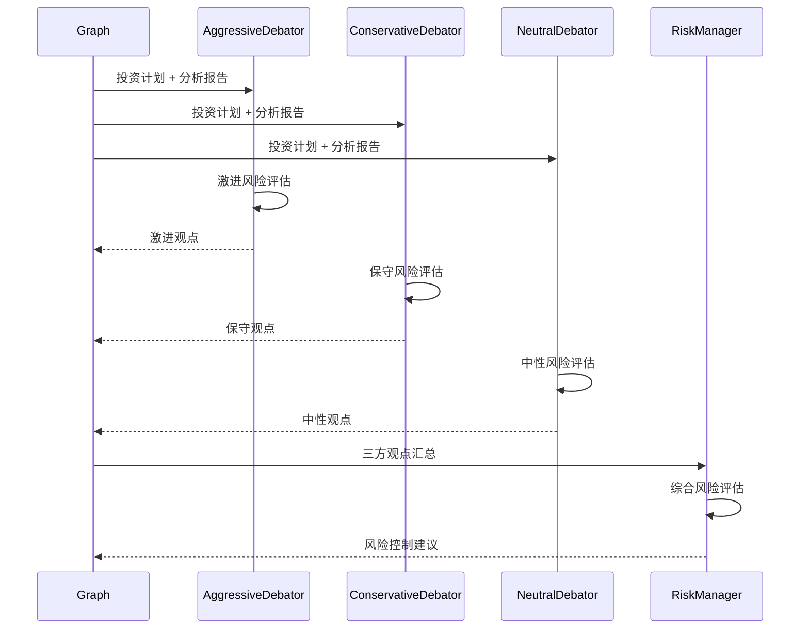

### 5. 最终交易决策阶段

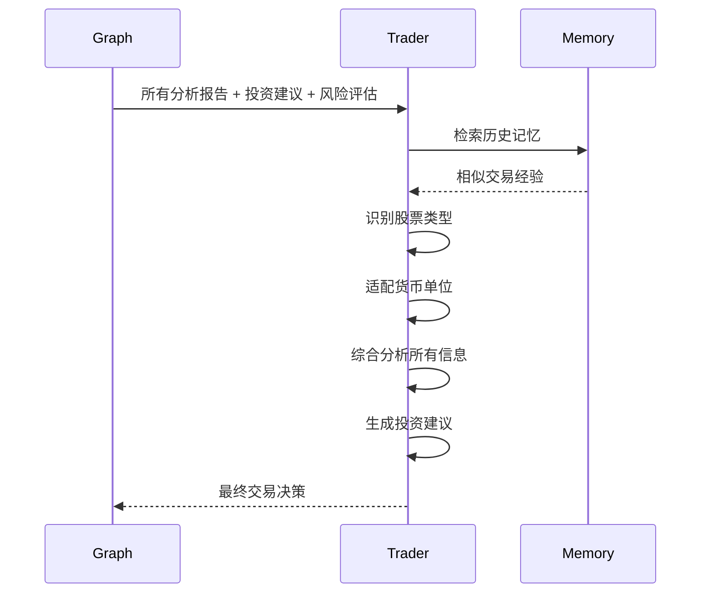

## 智能体通信机制

### 状态传递

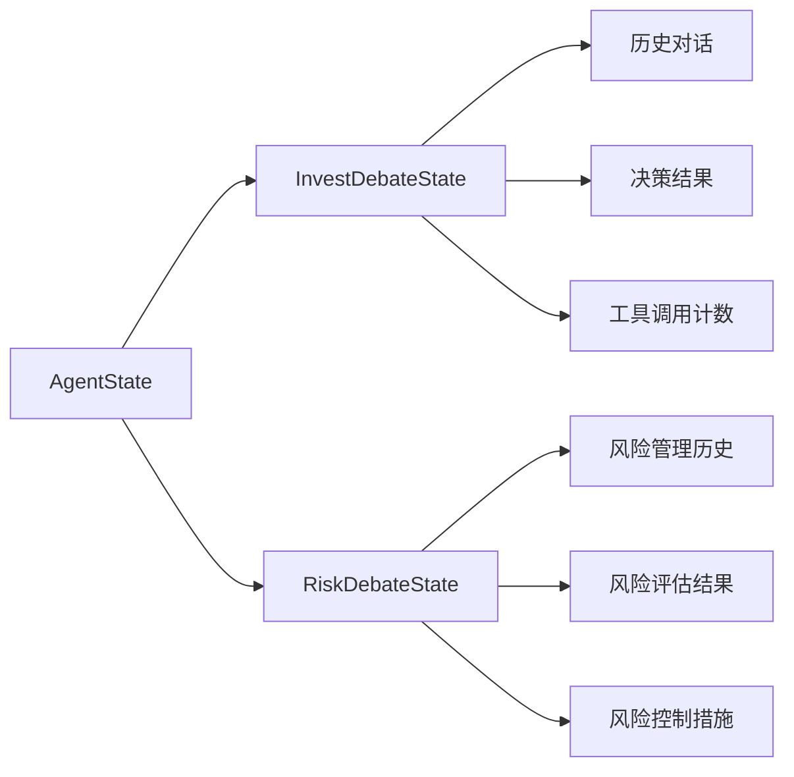

### 消息流转

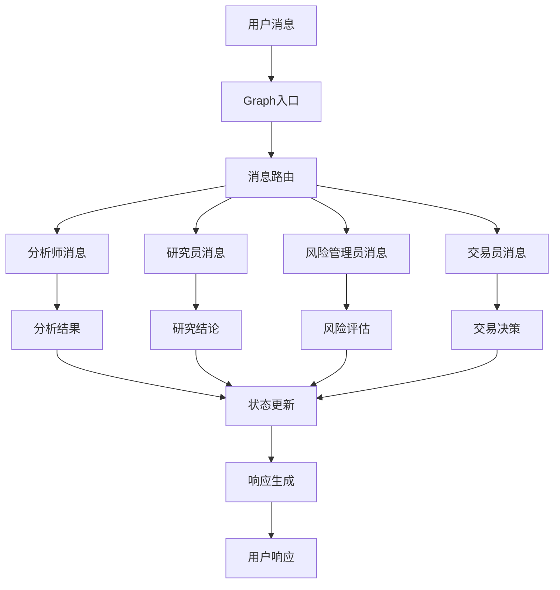

## 错误处理流程

### 异常捕获机制

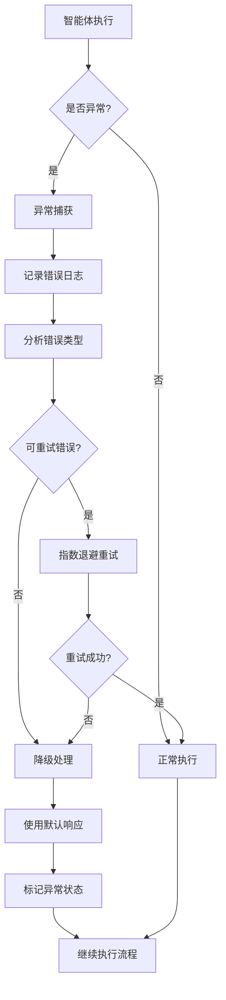

### 降级策略

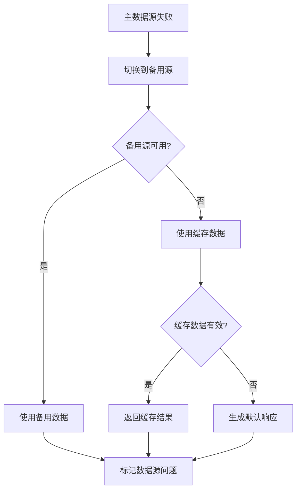

## 性能优化机制

### 并行处理

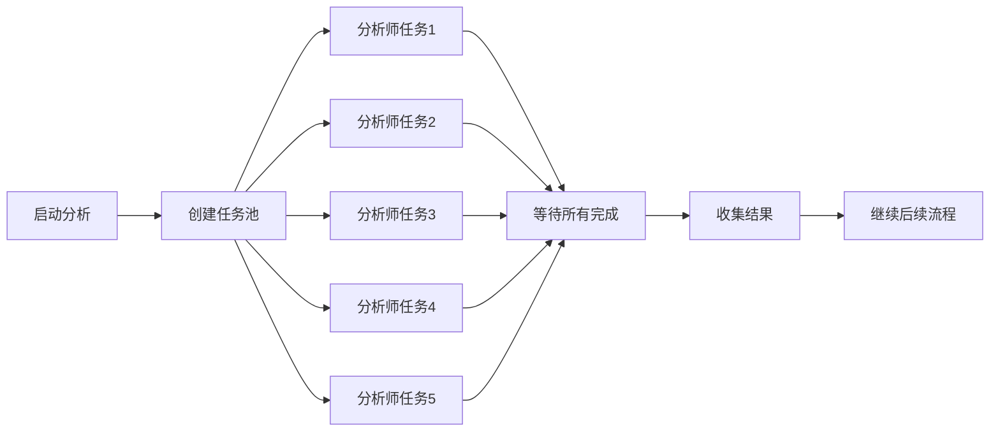

### 缓存机制

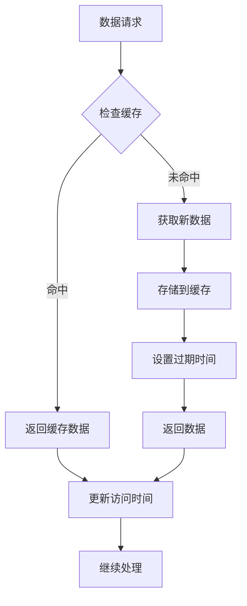

这个流程图详细展示了智能体系统的协作机制，从用户输入到最终投资建议的完整流程，包括并行处理、错误处理、状态管理等关键机制。