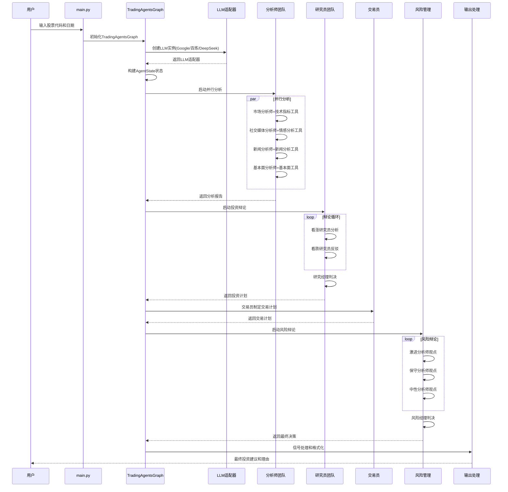
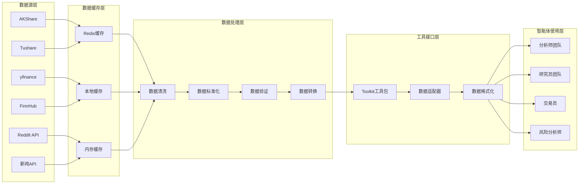

# TradingAgents 股票分析项目流程图

## 🏗️ 系统整体架构流程图

```mermaid
graph TB
    subgraph "输入层"
        INPUT[用户输入: 股票代码 + 日期]
        CONFIG[配置: LLM提供商 + 模型类型 + 工具设置]
    end
    
    subgraph "LLM初始化层"
        LLM_INIT[LLM适配器初始化]
        GOOGLE[Google AI]
        DASHSCOPE[阿里百炼]
        DEEPSEEK[DeepSeek]
        OPENAI[OpenAI]
    end
    
    subgraph "核心图构建层"
        GRAPH_BUILD[TradingAgentsGraph构建]
        STATE_INIT[AgentState状态初始化]
    end
    
    subgraph "并行分析层"
        PARALLEL_START[并行分析开始]
        
        subgraph "市场分析师"
            MARKET[市场分析师]
            MARKET_TOOLS[技术指标工具]
            MARKET_REPORT[市场分析报告]
        end
        
        subgraph "社交媒体分析师"
            SOCIAL[社交媒体分析师]
            SOCIAL_TOOLS[情感分析工具]
            SOCIAL_REPORT[社交媒体报告]
        end
        
        subgraph "新闻分析师"
            NEWS[新闻分析师]
            NEWS_TOOLS[新闻分析工具]
            NEWS_REPORT[新闻分析报告]
        end
        
        subgraph "基本面分析师"
            FUNDAMENTALS[基本面分析师]
            FUND_TOOLS[基本面工具]
            FUND_REPORT[基本面报告]
        end
    end
    
    subgraph "研究辩论层"
        DEBATE_START[投资辩论开始]
        
        subgraph "多头vs空头辩论"
            BULL[看涨研究员]
            BEAR[看跌研究员]
            BULL_MEMORY[多头记忆]
            BEAR_MEMORY[空头记忆]
            DEBATE_LOOP[辩论循环]
        end
        
        RESEARCH_MGR[研究经理判决]
        INVEST_PLAN[投资计划]
    end
    
    subgraph "交易执行层"
        TRADER[交易员]
        TRADE_PLAN[交易计划]
    end
    
    subgraph "风险管理辩论层"
        RISK_START[风险辩论开始]
        
        subgraph "风险偏好辩论"
            RISKY[激进分析师]
            SAFE[保守分析师]
            NEUTRAL[中性分析师]
            RISK_LOOP[风险辩论循环]
        end
        
        RISK_MGR[风险经理判决]
        FINAL_DECISION[最终交易决策]
    end
    
    subgraph "输出层"
        SIGNAL_PROCESS[信号处理]
        FINAL_OUTPUT[最终投资建议]
        REASONING[投资理由]
    end
    
    %% 流程连接
    INPUT --> CONFIG
    CONFIG --> LLM_INIT
    LLM_INIT --> GRAPH_BUILD
    GRAPH_BUILD --> STATE_INIT
    STATE_INIT --> PARALLEL_START
    
    PARALLEL_START --> MARKET
    PARALLEL_START --> SOCIAL
    PARALLEL_START --> NEWS
    PARALLEL_START --> FUNDAMENTALS
    
    MARKET --> MARKET_TOOLS
    MARKET_TOOLS --> MARKET_REPORT
    SOCIAL --> SOCIAL_TOOLS
    SOCIAL_TOOLS --> SOCIAL_REPORT
    NEWS --> NEWS_TOOLS
    NEWS_TOOLS --> NEWS_REPORT
    FUNDAMENTALS --> FUND_TOOLS
    FUND_TOOLS --> FUND_REPORT
    
    MARKET_REPORT --> DEBATE_START
    SOCIAL_REPORT --> DEBATE_START
    NEWS_REPORT --> DEBATE_START
    FUND_REPORT --> DEBATE_START
    
    DEBATE_START --> BULL
    DEBATE_START --> BEAR
    BULL --> BULL_MEMORY
    BEAR --> BEAR_MEMORY
    BULL_MEMORY --> DEBATE_LOOP
    BEAR_MEMORY --> DEBATE_LOOP
    DEBATE_LOOP --> BULL
    DEBATE_LOOP --> BEAR
    BULL --> RESEARCH_MGR
    BEAR --> RESEARCH_MGR
    RESEARCH_MGR --> INVEST_PLAN
    
    INVEST_PLAN --> TRADER
    TRADER --> TRADE_PLAN
    TRADE_PLAN --> RISK_START
    
    RISK_START --> RISKY
    RISK_START --> SAFE
    RISK_START --> NEUTRAL
    RISKY --> RISK_LOOP
    SAFE --> RISK_LOOP
    NEUTRAL --> RISK_LOOP
    RISK_LOOP --> RISKY
    RISK_LOOP --> SAFE
    RISK_LOOP --> NEUTRAL
    RISKY --> RISK_MGR
    SAFE --> RISK_MGR
    NEUTRAL --> RISK_MGR
    RISK_MGR --> FINAL_DECISION
    
    FINAL_DECISION --> SIGNAL_PROCESS
    SIGNAL_PROCESS --> FINAL_OUTPUT
    SIGNAL_PROCESS --> REASONING
    
    %% 样式定义
    classDef inputLayer fill:#e3f2fd,stroke:#1976d2,stroke-width:2px
    classDef llmLayer fill:#f3e5f5,stroke:#7b1fa2,stroke-width:2px
    classDef coreLayer fill:#e8f5e8,stroke:#388e3c,stroke-width:2px
    classDef analysisLayer fill:#fff3e0,stroke:#f57c00,stroke-width:2px
    classDef debateLayer fill:#fce4ec,stroke:#c2185b,stroke-width:2px
    classDef tradeLayer fill:#e0f2f1,stroke:#00695c,stroke-width:2px
    classDef riskLayer fill:#ffebee,stroke:#d32f2f,stroke-width:2px
    classDef outputLayer fill:#f1f8e9,stroke:#558b2f,stroke-width:2px
    
    class INPUT,CONFIG inputLayer
    class LLM_INIT,GOOGLE,DASHSCOPE,DEEPSEEK,OPENAI llmLayer
    class GRAPH_BUILD,STATE_INIT coreLayer
    class PARALLEL_START,MARKET,SOCIAL,NEWS,FUNDAMENTALS,MARKET_TOOLS,SOCIAL_TOOLS,NEWS_TOOLS,FUND_TOOLS,MARKET_REPORT,SOCIAL_REPORT,NEWS_REPORT,FUND_REPORT analysisLayer
    class DEBATE_START,BULL,BEAR,BULL_MEMORY,BEAR_MEMORY,DEBATE_LOOP,RESEARCH_MGR,INVEST_PLAN debateLayer
    class TRADER,TRADE_PLAN tradeLayer
    class RISK_START,RISKY,SAFE,NEUTRAL,RISK_LOOP,RISK_MGR,FINAL_DECISION riskLayer
    class SIGNAL_PROCESS,FINAL_OUTPUT,REASONING outputLayer
```

## 🔍 详细AI调用流程图

## 🧠 单个分析师AI调用详细流程

```mermaid
graph TD
    subgraph "单个分析师AI调用流程"
        START[分析师节点启动]
        
        STATE_CHECK[检查AgentState状态]
        PARAMS_EXTRACT[提取参数: 股票代码, 日期]
        
        TOOL_SELECTION[工具选择逻辑]
        ONLINE_CHECK{在线工具?}
        
        ONLINE_TOOLS[在线工具: API调用]
        OFFLINE_TOOLS[离线工具: 本地数据]
        
        PROMPT_BUILD[构建LLM提示词]
        CONTEXT_ADD[添加上下文信息]
        
        LLM_CALL[调用LLM模型]
        TOKEN_TRACK[Token使用跟踪]
        
        RESPONSE_PARSE[解析LLM响应]
        TOOL_CALL_CHECK{需要工具调用?}
        
        TOOL_EXEC[执行工具调用]
        RESULT_PROCESS[处理工具结果]
        
        REPORT_GEN[生成分析报告]
        STATE_UPDATE[更新AgentState]
        
        LOOP_CHECK{继续分析?}
        MAX_CHECK{超过最大调用次数?}
        
        END[返回更新后的状态]
    end
    
    START --> STATE_CHECK
    STATE_CHECK --> PARAMS_EXTRACT
    PARAMS_EXTRACT --> TOOL_SELECTION
    TOOL_SELECTION --> ONLINE_CHECK
    
    ONLINE_CHECK -->|是| ONLINE_TOOLS
    ONLINE_CHECK -->|否| OFFLINE_TOOLS
    
    ONLINE_TOOLS --> PROMPT_BUILD
    OFFLINE_TOOLS --> PROMPT_BUILD
    
    PROMPT_BUILD --> CONTEXT_ADD
    CONTEXT_ADD --> LLM_CALL
    LLM_CALL --> TOKEN_TRACK
    TOKEN_TRACK --> RESPONSE_PARSE
    
    RESPONSE_PARSE --> TOOL_CALL_CHECK
    TOOL_CALL_CHECK -->|是| TOOL_EXEC
    TOOL_CALL_CHECK -->|否| REPORT_GEN
    
    TOOL_EXEC --> RESULT_PROCESS
    RESULT_PROCESS --> REPORT_GEN
    
    REPORT_GEN --> STATE_UPDATE
    STATE_UPDATE --> LOOP_CHECK
    
    LOOP_CHECK -->|是| MAX_CHECK
    LOOP_CHECK -->|否| END
    
    MAX_CHECK -->|否| TOOL_SELECTION
    MAX_CHECK -->|是| REPORT_GEN
    
    STATE_UPDATE --> END
```

## 💰 Token使用和成本跟踪流程

```mermaid
graph TD
    subgraph "Token使用跟踪系统"
        LLM_CALL[LLM API调用]
        
        TOKEN_CAPTURE[捕获Token使用数据]
        USAGE_DATA{Token使用数据}
        
        TOKEN_INPUT[输入Token数量]
        TOKEN_OUTPUT[输出Token数量]
        TOKEN_TOTAL[总Token数量]
        
        COST_CALC[成本计算]
        MODEL_PRICE[模型单价配置]
        
        INPUT_COST[输入成本]
        OUTPUT_COST[输出成本]
        TOTAL_COST[总成本]
        
        USAGE_RECORD[记录使用情况]
        MONGODB_STORE[MongoDB存储]
        
        COST_REPORT[生成成本报告]
        BUDGET_CHECK[预算检查]
        ALERT_SYSTEM[成本预警]
    end
    
    LLM_CALL --> TOKEN_CAPTURE
    TOKEN_CAPTURE --> USAGE_DATA
    
    USAGE_DATA --> TOKEN_INPUT
    USAGE_DATA --> TOKEN_OUTPUT
    TOKEN_INPUT --> TOKEN_TOTAL
    TOKEN_OUTPUT --> TOKEN_TOTAL
    
    TOKEN_TOTAL --> COST_CALC
    MODEL_PRICE --> COST_CALC
    
    COST_CALC --> INPUT_COST
    COST_CALC --> OUTPUT_COST
    INPUT_COST --> TOTAL_COST
    OUTPUT_COST --> TOTAL_COST
    
    TOTAL_COST --> USAGE_RECORD
    USAGE_RECORD --> MONGODB_STORE
    
    MONGODB_STORE --> COST_REPORT
    COST_REPORT --> BUDGET_CHECK
    BUDGET_CHECK --> ALERT_SYSTEM
```

## 📊 数据流和处理流程

## 🎯 核心优势总结

### 1. **多LLM支持**
- 支持Google AI、阿里百炼、DeepSeek、OpenAI等多个LLM提供商
- 统一的LLM适配器接口，便于扩展新的LLM提供商
- 智能的LLM选择和配置管理

### 2. **多智能体协作**
- 模拟真实金融机构的团队协作模式
- 并行分析层：市场、社交、新闻、基本面四大分析师
- 辩论机制：投资辩论和风险辩论，确保决策的全面性

### 3. **智能工具调用**
- 支持在线和离线两种工具模式
- 智能工具选择和调用机制
- 工具调用结果的标准化处理

### 4. **状态管理和记忆**
- 统一的AgentState状态管理
- 智能体间的记忆共享和经验积累
- 支持多轮对话和复杂的工作流

### 5. **成本控制和监控**
- 详细的Token使用跟踪
- 实时的成本计算和预算管理
- 成本预警和优化建议

### 6. **数据流管理**
- 多数据源集成和统一管理
- 智能缓存策略，提高数据获取效率
- 数据清洗和标准化处理

这个流程图展示了TradingAgents项目从用户输入到最终投资建议的完整AI调用流程，体现了多智能体协作、多LLM支持、智能工具调用等核心特性。